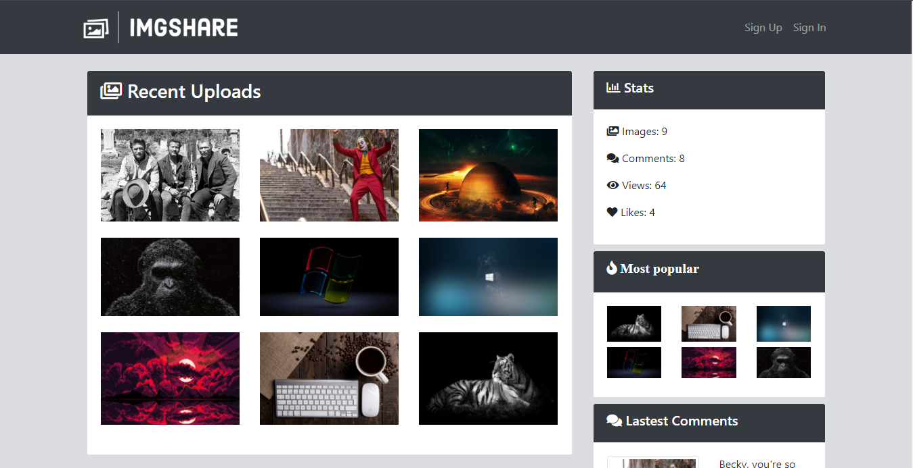
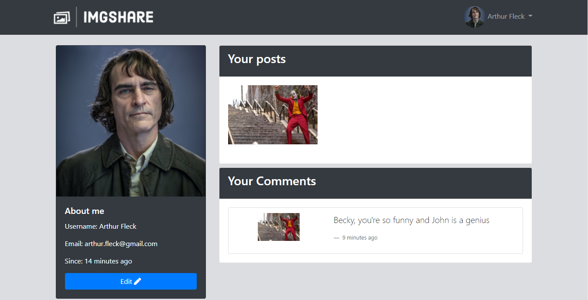

# Red social para postear imágenes hecha con Node.js y MongoDB
### Para iniciar sesión y probar algunas funcionalidade: email = becky@gmail.com; password: becky
#### O simplemente puedes crear una cuenta
### Agradecimiento especial a Fazt, cuyo proyecto fue tomado como base: https://www.youtube.com/watch?v=TqC3e8nBycg&t=12403s&ab_channel=Fazt 

